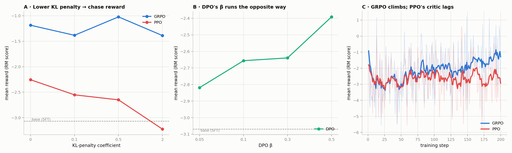
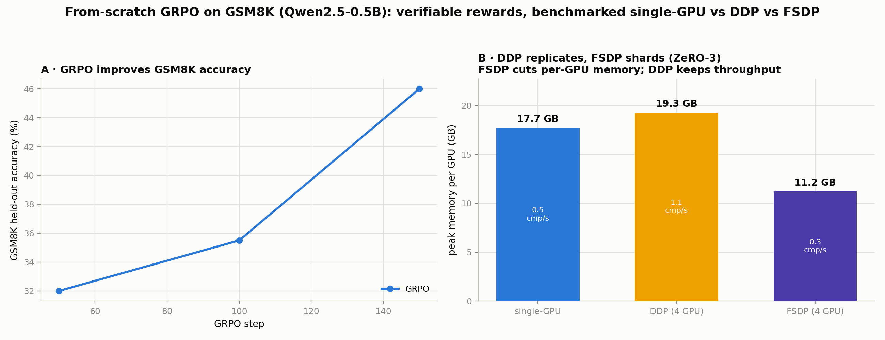

# RLHF / GRPO from scratch

The post-training half of a modern LLM — reward modeling, the RL objectives
(**PPO, GRPO, DPO** + 4 more), and the **multi-GPU internals** (DDP, FSDP/ZeRO-3, tensor
parallelism) — rebuilt from primitives in pure PyTorch, with **no TRL / verl**. These are
the exact mechanics frontier labs use to align and scale models; writing them out
end-to-end and reproducing a real **DeepSeek-R1-style** reasoning result is the point.

Everything runs on CPU with a tiny model for fast iteration and scales to real checkpoints
(gpt2-medium, Qwen2.5) on multi-GPU via torchrun + NCCL.

> 📊 **[Interactive walkthrough of the results →](https://claude.ai/code/artifact/0adddf62-f547-4a88-bcae-2f8896d6ac97)**

## What it demonstrates

- **Reward modeling** — a Bradley–Terry model on real human preferences: **68%** held-out
  pairwise accuracy (50% = random).
- **Policy optimization from the math up** — PPO (GAE, clipped surrogate, value head) and
  GRPO (critic-free group-relative advantages) with KL control, plus DPO / IPO / KTO /
  ORPO / SimPO.
- **A real reasoning result** — the DeepSeek-R1 recipe (GRPO on a *verifiable* reward)
  lifts grade-school-math accuracy **32% → 46%**.
- **Distributed internals** — hand-written DDP, FSDP/ZeRO-3, and Megatron-style tensor
  parallelism, benchmarked for the real memory/throughput tradeoff.

## Results

Two tracks; full reproduction steps in [CLAUDE.md](CLAUDE.md).

### Part 1 — Aligning a policy against a learned reward model



A gpt2-medium reward model (**68%** held-out accuracy on `Dahoas/rm-static`) scores a
policy that PPO, GRPO, and DPO optimize.

- **The KL knob works both ways** — for PPO/GRPO a larger KL penalty keeps the policy near
  base, so reward drops; DPO's β scales *toward* the objective, so reward climbs (the
  mirror image, and a check that both are wired right). GRPO stays above PPO throughout.
- **GRPO is more sample-efficient** — reward rises faster per step, because it sidesteps
  PPO's noisy learned value function with a critic-free group baseline.

### Part 2 — GRPO on GSM8K with a verifiable reward



The DeepSeek-R1 recipe from scratch: GRPO fine-tunes **Qwen2.5-0.5B-Instruct** on GSM8K
with a **verifiable reward** — the model is rewarded only for getting the *answer* right
(`rlhf/gsm8k.py`), no learned RM to game.

- **The reward is real task skill** — answer-correctness lifts held-out accuracy
  **32% → 46%**.
- **DDP vs FSDP is a genuine tradeoff** — the *same* loop under FSDP (ZeRO-3) shards
  optimizer state to **11.2 GB/GPU** vs DDP's **19.3 GB**; DDP keeps the throughput lead.

## Quickstart

```bash
pip install -r requirements.txt
pytest -q                              # fast math/TP unit tests (no downloads)
python -m experiments.pipeline_demo    # end-to-end SFT→RM→win-rate→chat on tiny-gpt2
```

## Reproduce on coe-hpc3

```bash
python scripts/predownload.py        # once, on the login node (caches models + datasets)

# Part 1 — alignment
sbatch scripts/train_reward.slurm    # reward model     → results/reward_model/
sbatch scripts/align.slurm           # frontier + sample efficiency → figures/alignment.png

# Part 2 — GRPO on GSM8K
sbatch scripts/gsm8k_grpo.slurm      # single/DDP/FSDP sweep → figures/gsm8k_grpo.png
```

## Layout

- **`rlhf/`** — from-scratch primitives: `reward.py` (RM + Bradley-Terry), `ppo.py`,
  `grpo.py`, `preference.py` (DPO/IPO/KTO/ORPO/SimPO), `gsm8k.py` (loader + verifiable
  reward), `sampling.py` (FSDP-safe rollout + masked log-probs), plus `models.py`,
  `decoding.py`, `data.py`, `tokenization.py`, `losses.py`, `optim.py` (AdamW), `sft.py`,
  `lora.py`, `eval.py`.
- **`rlhf/parallel/`** — `dist.py` (NCCL bootstrap), `ddp.py`, `fsdp.py` (ZeRO-3 +
  peak-mem), `tensor_parallel.py` (Megatron column/row-parallel linears with custom
  autograd collectives, verified against `nn.Linear` in `tests/test_tensor_parallel.py`).
- **`experiments/`** — `train_reward_model.py`, `exp1_alignment_frontier.py`,
  `exp2_grpo_sample_efficiency.py`, `gsm8k_grpo.py`, the `plot_*` renderers,
  `pipeline_demo.py`, and `common.py` (shared alignment harness).
- **`scripts/`** — `predownload.py` + Slurm jobs for coe-hpc3.
- **`tests/`** — hermetic unit tests for the RL math + tensor-parallel correctness.
